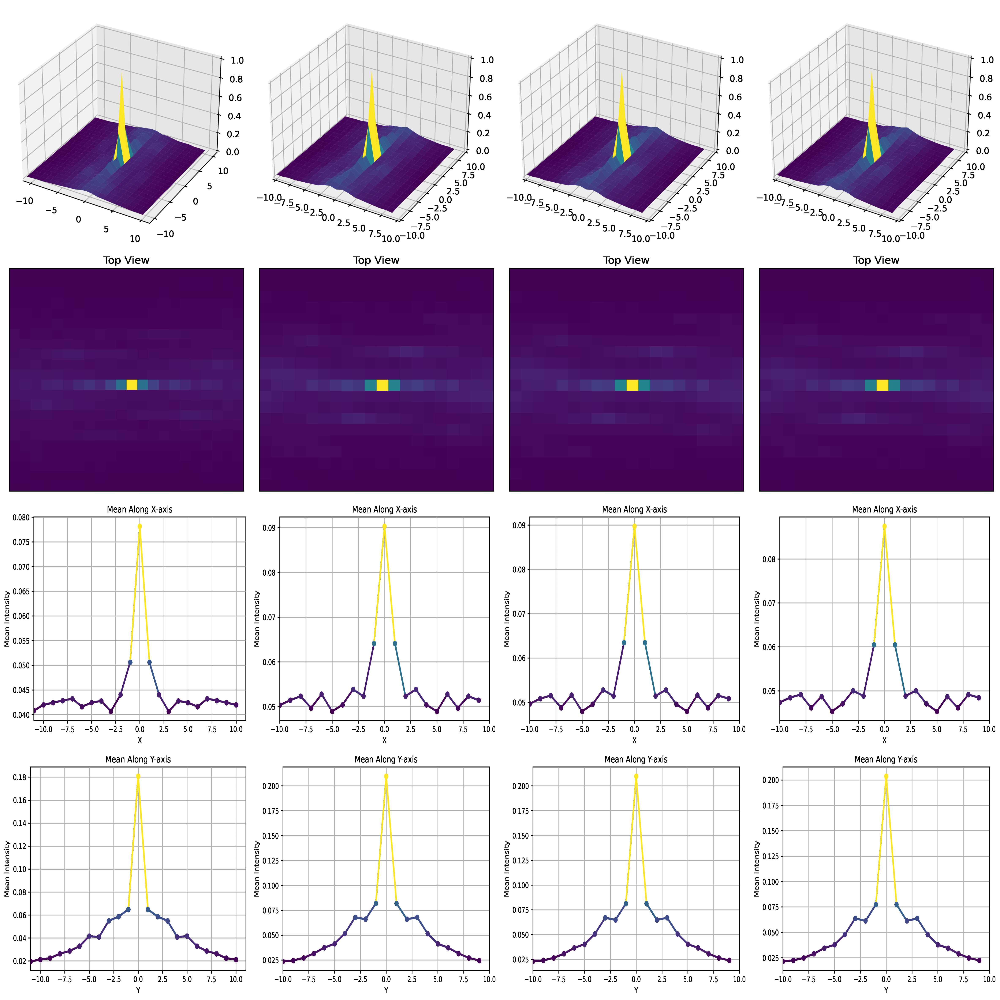

# Rebuttal
We have consolidated all content onto a single page for the convenience of reviewers during the rebuttal period. The first half of this page contains all the materials requested by the reviewers that could not be accommodated within the one-page rebuttal file. The latter half presents the original GitHub assets associated with this project.

## For Reviewer <span style="color:DarkViolet;">m4Ff</span>
In the manuscript, we stated, "In other words, directly altering the input feature’s frequency spectrum can help transmit the entire set of features more effectively, rather than just those elements associated with the target." This claim suggests that directly manipulating the frequency spectrum of input features, a common technique in signal processing systems, is insufficient for the video object tracking task. This is because video object tracking also requires the preservation of spatial information, which is not fully addressed by frequency spectrum modification alone.

We also utilized Figure 3 to support this claim. However, Reviewer m4Ff has expressed that it doesn't back up anything. Actually, we have made several attempts on that. Our motivation is quite straightforward: Assume the tracker is a filter → Measure the Unit Impulse Response (UIR) → Try to modulate the token according to the UIR → Hope the modulating process will facilitate the passage of the token. Our failures in those attempts suggest that modulating the entire token instead of the tokens related to the target didn't actually change the performance. Below, we will describe how we modulate the token and report the performance across various benchmarks.

We first measure the Unit Impulse Response (UIR) for each encode layer to know the intrinsic properties of the layers. Then we apply the fourier transform on the input token to get its spectrum:


Then, we applied four distinct frequency modulation techniques, each designed to alter only the frequency components of the entire token, without incorporating any spatial priors.

<details>
    <summary>Click to show the code</summary>
    <div class="code-container">
        <pre><code>
def dist(number, mean_list,std_list, tolerance=0.1, adjustment_factor=10):
    mean_value = np.mean(mean_list)
    std_dev_value = sum(std_list)/(len(std_list)**0.5)

    # Compute the PDF for the given number
    target_probability = norm.pdf(number, mean_value, std_dev_value)

    # Compute the PDF for each sample in vector_list
    #print(np.sum(target_probability))
    # Adjust the probability based on the distribution of vector_list
    adjusted_probability = target_probability / np.sum(target_probability)

    # Apply an adjustment factor to make the probabilities relatively larger
    adjusted_probability *= adjustment_factor

    return adjusted_probability

def dd(data, threshold=3.5):
    data_mean = np.mean(data)
    data_std = np.std(data)
    z_scores = np.abs((data - data_mean) / data_std)

    # 计算每个位置为异常值的概率
    outlier_probs = 1.0 / (1.0 + np.exp(-z_scores))

    return outlier_probs

def cos_window(sz):
    cos_window = np.hanning(int(sz[1]))[:, np.newaxis].dot(np.hanning(int(sz[0]))[np.newaxis, :])
    return cos_window

class BaseModulator():
    def __init__(self, freq):
        self.freq
    def _modulate_(self,image):
        pass
    

class Modulator1(BaseModulator):
    def __init__(self, freq,log_flag=False):

        self.interp_factor=0.125
        
        # System Fourier Characteristic
        
        if log_flag:
            freq = freq.log()

        self.SFC = freq

        b,c,h,w = freq.shape
        tmp = freq

        tmp = tmp + 1e-6

        tmp = torch.roll(tmp, shifts=(int(h/2), int(w/2)), dims=(2, 3))

        tmp = tmp.mean(dim=(0, 1))
        min_index = torch.argmin(tmp.abs()).item()
        max_index_2d = (min_index // tmp.shape[1], min_index % tmp.shape[1])
        self.mh,self.mw = max_index_2d
        # -----------------------------------------------------------------------
        self.freq_charac = tmp.diag()[int(h/2):].cpu().detach().numpy()   
        self.freq_index = np.argmax(self.freq_charac)
        
        # -----------------------------------------------------------------------

        tmp = tmp/tmp.sum()

        self.mover = tmp
        self.H = 0
        self.modulator = None
        self.score_list = []
        self.score = 0
        self.d = 0
        self.mean = []
        self.std = []

    def _preprocessing(self,img,cos_window,eps=1e-5):
        img=np.log(img+1)
        img=(img-np.mean(img))/(np.std(img)+eps)
        return cos_window*img
    
    def _rand_warp(self,img):
        h, w = img.shape[:2]
        C = .1
        ang = np.random.uniform(-C, C)
        c, s = np.cos(ang), np.sin(ang)
        W = np.array([[c + np.random.uniform(-C, C), -s + np.random.uniform(-C, C), 0],
                      [s + np.random.uniform(-C, C), c + np.random.uniform(-C, C), 0]])
        center_warp = np.array([[w / 2], [h / 2]])
        tmp = np.sum(W[:, :2], axis=1).reshape((2, 1))
        W[:, 2:] = center_warp - center_warp * tmp
        warped = cv2.warpAffine(img, W, (w, h), cv2.BORDER_REFLECT)
        return warped
        
    def _modulate_(self,image,coords):
        x,y,w,h = coords
        
        w = 1.5*w
        h = 1.5*h
        x1 = x - 1/4*w
        y1 = y- 1/4*h
        x2 = x + 5/4*w
        y2 = y + 5/4*h
        H,W,C = image.shape
        x1 = int(max(0,x1))
        y1 = int(max(0,y1))
        x2 = int(min(x2,W))
        y2 = int(min(y2,H))
        w = int(x2-x1)
        h = int(y2-y1)

        
        image_tmp = image
        #image_tmp = image.numpy()
        #image_tmp = image_tmp[0]
        #image_tmp = image_tmp.transpose((1, 2, 0))
        #print(image_tmp.shape)
        if len(image_tmp.shape)!=2:
            #print(image_tmp.shape,image_tmp.shape[2]==3)
            assert image_tmp.shape[2]==3
            image_tmp=cv2.cvtColor(image_tmp,cv2.COLOR_BGR2GRAY)
        image_tmp=image_tmp.astype(np.float32)/255
        #print(3)
        self._center=(x+w/2,y+h/2)
        self.w,self.h=w,h
        w,h=int(round(w)),int(round(h))
        #print(3)
        self.cos_window=cos_window((w,h))
        #print(3)
        self._fi=cv2.getRectSubPix(image_tmp,(w,h),self._center)
        #print(type(self._fi),self._fi.shape)
        #print(3)
        mover = self.mover
        mover = mover.detach().cpu().numpy()
        #print(type(mover),mover.shape,mover)
        real_part = mover.real
        imag_part = mover.imag
        resized_real = cv2.resize(real_part, (w, h), interpolation=cv2.INTER_LINEAR)
        resized_imag = cv2.resize(imag_part, (w, h), interpolation=cv2.INTER_LINEAR)
        mover = resized_real + 1j * resized_imag
        self._Ai=np.zeros_like(mover)
        self._Bi=np.zeros_like(mover)
        #print(3)
        fi=self._rand_warp(self._fi)
        Fi=np.fft.fft2(self._preprocessing(fi,self.cos_window))
        shift_h = int(h / 2)
        shift_w = int(w / 2)

        Fi = np.roll(Fi, shift=-shift_h, axis=0)

        Fi = np.roll(Fi, shift=-shift_w, axis=1)
        self._Ai=mover*np.conj(Fi)
        self._Bi=Fi*np.conj(Fi)
        if isinstance(self.H,int):
            self.H = self._Ai/self._Bi
        else:
            #print(self._Ai.shape,self.H.shape)
            H_shape = self.H.shape
            f = interp2d(np.arange(H_shape[1]), np.arange(H_shape[0]), self.H, kind='linear')
            Ai_shape = self._Ai.shape
            # 创建一个新的网格，对应于目标矩阵Ai的大小
            new_grid_x = np.arange(Ai_shape[1])
            new_grid_y = np.arange(Ai_shape[0])
            new_H = f(new_grid_x, new_grid_y)
            self.H =self.interp_factor*(mover*np.conj(Fi))/(Fi*np.conj(Fi))+(1-self.interp_factor)*new_H
        #Hi = torch.from_numpy(self.H).unsqueeze(0).unsqueeze(0).float()
        #print(Hi.shape)
        Hi = self.H
        img_fre=np.fft.fft2(image[y1:y2,x1:x2,:])
        shift_w = int(w / 2)
        shift_h = int(h/2)
        img_fre = np.roll(img_fre, shift=-shift_h, axis=0)
        img_fre = np.roll(img_fre, shift=-shift_w, axis=1)

        Gi=Hi[:,:,np.newaxis]*img_fre
        #print(Hi.shape,img_fre.shape,Gi.shape)
        Gi = np.roll(Gi, shift=-shift_h, axis=0)
        Gi = np.roll(Gi, shift=-shift_w, axis=1)
        

        gi = np.real(np.fft.ifft2(Gi))

        self.score_list.append(gi)
        self.score = gi
        gi = gi/gi.max()


        gi_tmp = gi*255

        img_fre = np.fft.fft2(image)
        num_offset = 60
        if len(self.mean)<num_offset:
            self.mean.append(np.mean(gi))
            self.std.append(np.std(gi))

            image[y1:y2,x1:x2,:] =  (1-gi)*image[y1:y2,x1:x2,:] + gi_tmp*gi
            
            

            # more
            #img_fre = torch.roll(img_fre, shifts=(int(self.mh), int(self.mw)), dims=(0, 1))
            
            img_fre = np.roll(img_fre, shift=-int(self.mh), axis=0)
            img_fre = np.roll(img_fre, shift=-int(self.mw), axis=1)
            

            img_modu = np.abs(np.fft.ifft2(img_fre))
            

            #print(gi.mean()) tensor(0.5128)
            #print(image.shape,gi.shape,img_modu.shape,gi.mean())
            # (432, 576, 3) (182, 76, 3) (432, 576, 3)
            # operands could not be broadcast together with shapes (234,108) (182,76)
            image = (1-gi.mean()*0.08)*image + gi.mean()*0.08*img_modu

            return image        
        elif len(self.mean) == num_offset:
            #print(len(self.score_list))

            self.d = dist(self.score,self.mean,self.std)
            d = self.d
            
            #print(d.max(),d.min())
            # more
            
            
            img_fre = np.roll(img_fre, shift=-int(self.mh), axis=0)
            img_fre = np.roll(img_fre, shift=-int(self.mw), axis=1)
            #print(d.max(),d.min())
            img_modu = np.abs(np.fft.ifft2(img_fre))
            
            d_tmp = d.min()
            
            image = (1-d_tmp*0.08)*image + d_tmp*0.08*img_modu
            return image
        else:

            #self.d = dist(self.score,self.score_list[1:-1])
            #d=self.d
            #print(self.d.shape)
            if self.d.shape[0] != int(y2-y1) or self.d.shape[1] != int(x2-x1):
                #print("reshaping")
                target_height = int(y2 - y1)
                target_width = int(x2 - x1)
                self.d = cv2.resize(self.d, (target_width, target_height), interpolation=cv2.INTER_NEAREST)  
            d = self.d    
            #print(gi_tmp.shape,d.shape,image[y1:y2,x1:x2,:].shape)
            image[y1:y2,x1:x2,:] =  (1-d)*image[y1:y2,x1:x2,:] + gi_tmp*d
            #print(1)
            #print(gi_tmp.shape,d.shape,image[y1:y2,x1:x2,:].shape)
            image[y1:y2,x1:x2,:] =  (1-d)*image[y1:y2,x1:x2,:] + gi_tmp*d
            
            
            #print(d.max(),d.min())
            # more
            img_fre = np.roll(img_fre, shift=-int(self.mh), axis=0)
            img_fre = np.roll(img_fre, shift=-int(self.mw), axis=1)
            #print(d.max(),d.min())
            img_modu = np.abs(np.fft.ifft2(img_fre))
            
            #print(d.max(),d.min())
            #print(gi.mean()) tensor(0.5128)
            d_tmp = d.min()
            image = (1-d_tmp)*0.08*image + d_tmp*0.08*img_modu

            return image        
    @staticmethod
    def draw_freq(image):
        pass
    
    


class Modulator2(BaseModulator):
    def __init__(self, freq,log_flag=False):
        if log_flag:
            freq = freq.log()

        self.SFC = freq

        b,c,h,w = freq.shape
        tmp = freq

        tmp = tmp + 1e-6

        tmp = torch.roll(tmp, shifts=(int(h/2), int(w/2)), dims=(2, 3))

        tmp = tmp.mean(dim=(0, 1))
        min_index = torch.argmin(tmp.abs()).item()
        min_index_2d = (min_index // tmp.shape[1], min_index % tmp.shape[1])
        self.mh,self.mw = min_index_2d
        # -----------------------------------------------------------------------
        self.freq_charac = tmp.diag()[int(h/2):].cpu().detach().numpy()   
        self.freq_index = np.argmax(self.freq_charac)
        
        # -----------------------------------------------------------------------

        tmp = tmp/tmp.sum()

        self.mover = tmp
        self.H = 0
        self.modulator = None
        self.score_list = []
        self.score = 0
        self.d = 0

    def _preprocessing(self,img,cos_window,eps=1e-5):
        img=np.log(img+1)
        img=(img-np.mean(img))/(np.std(img)+eps)
        return cos_window*img
    
    def _rand_warp(self,img):
        h, w = img.shape[:2]
        C = .1
        ang = np.random.uniform(-C, C)
        c, s = np.cos(ang), np.sin(ang)
        W = np.array([[c + np.random.uniform(-C, C), -s + np.random.uniform(-C, C), 0],
                      [s + np.random.uniform(-C, C), c + np.random.uniform(-C, C), 0]])
        center_warp = np.array([[w / 2], [h / 2]])
        tmp = np.sum(W[:, :2], axis=1).reshape((2, 1))
        W[:, 2:] = center_warp - center_warp * tmp
        warped = cv2.warpAffine(img, W, (w, h), cv2.BORDER_REFLECT)
        return warped
        
    def _modulate_(self,image,coords):
        x,y,w,h = coords
        w = 1.5*w
        h = 1.5*h
        x1 = x - 1/4*w
        y1 = y- 1/4*h
        x2 = x + 5/4*w
        y2 = y + 5/4*h
        H,W,C = image.shape
        x1 = int(max(0,x1))
        y1 = int(max(0,y1))
        x2 = int(min(x2,W))
        y2 = int(min(y2,H))
        w = int(x2-x1)
        h = int(y2-y1)

        image_tmp = image
        if len(image_tmp.shape)!=2:
            assert image_tmp.shape[2]==3
            image_tmp=cv2.cvtColor(image_tmp,cv2.COLOR_BGR2GRAY)
        image_tmp=image_tmp.astype(np.float32)/255
        self._center=(x+w/2,y+h/2)
        self.w,self.h=w,h
        w,h=int(round(w)),int(round(h))
        self.cos_window=cos_window((w,h))
        self._fi=cv2.getRectSubPix(image_tmp,(w,h),self._center)
        mover = self.mover
        mover = mover.detach().cpu().numpy()
        real_part = mover.real
        imag_part = mover.imag
        resized_real = cv2.resize(real_part, (w, h), interpolation=cv2.INTER_LINEAR)
        resized_imag = cv2.resize(imag_part, (w, h), interpolation=cv2.INTER_LINEAR)
        mover = resized_real + 1j * resized_imag
        mover = np.abs(mover)
        # dd
        mover_prob = dd(mover)
        self._Ai=np.zeros_like(mover)
        self._Bi=np.zeros_like(mover)
        #print(3)
        fi=self._fi
        Fi=np.fft.fft2(self._preprocessing(fi,self.cos_window))
        shift_h = int(h / 2)
        shift_w = int(w / 2)

        Fi = np.roll(Fi, shift=-shift_h, axis=0)
        Fi = (1-mover_prob)*Fi
        Fi = np.roll(Fi, shift=-shift_w, axis=1)
        
        pic = np.real(np.fft.ifft2(Fi))
        #print(mover_prob.max(),mover_prob.min())
        #print(mover_prob[:,:,np.newaxis].shape,pic.shape,image[y1:y2,x1:x2,:].shape)
        # torch.Size([182, 76, 1]) (182, 76) (182, 76, 3)
        image[y1:y2,x1:x2,:] =  (1-0.28*mover_prob[:,:,np.newaxis])*pic[:,:,np.newaxis] + 0.28*mover_prob[:,:,np.newaxis]*image[y1:y2,x1:x2,:]
        #print(2)
        return image        
    @staticmethod
    def draw_freq(image):
        pass


class Modulator3(BaseModulator):
    def __init__(self, freq,log_flag=False):
        if log_flag:
            freq = freq.log()

        self.SFC = freq

        b,c,h,w = freq.shape
        
        
        h_t = np.linspace(0,1,h)
        w_t = np.linspace(0,1,w)
        h_fc = 0
        w_fc = 0
        for i in range(h):
            h_fc = h_fc + np.cos(2*np.pi*(i+1)*h_t)
        for j in range(w):
            w_fc = w_fc + np.cos(2*np.pi*(j+1)*w_t)
        #print(h_fc.shape,w_fc.shape,h,w)
        m1,m2 = np.meshgrid(h_fc, w_fc)
        self.mover = m1*m2
        tmp = freq

        tmp = tmp + 1e-6

        tmp = torch.roll(tmp, shifts=(int(h/2), int(w/2)), dims=(2, 3))

        tmp = tmp.mean(dim=(0, 1))
        
        tmp = tmp/tmp.sum()

        self.weight = tmp.detach().cpu().numpy()
        

    def _preprocessing(self,img,cos_window,eps=1e-5):
        img=np.log(img+1)
        img=(img-np.mean(img))/(np.std(img)+eps)
        return cos_window*img
    
    def _rand_warp(self,img):
        h, w = img.shape[:2]
        C = .1
        ang = np.random.uniform(-C, C)
        c, s = np.cos(ang), np.sin(ang)
        W = np.array([[c + np.random.uniform(-C, C), -s + np.random.uniform(-C, C), 0],
                      [s + np.random.uniform(-C, C), c + np.random.uniform(-C, C), 0]])
        center_warp = np.array([[w / 2], [h / 2]])
        tmp = np.sum(W[:, :2], axis=1).reshape((2, 1))
        W[:, 2:] = center_warp - center_warp * tmp
        warped = cv2.warpAffine(img, W, (w, h), cv2.BORDER_REFLECT)
        return warped
        
    def _modulate_(self,image,coords):
        x,y,w,h = coords
        w = 1.5*w
        h = 1.5*h
        x1 = x - 1/4*w
        y1 = y- 1/4*h
        x2 = x + 5/4*w
        y2 = y + 5/4*h
        H,W,C = image.shape
        x1 = int(max(0,x1))
        y1 = int(max(0,y1))
        x2 = int(min(x2,W))
        y2 = int(min(y2,H))
        w = int(x2-x1)
        h = int(y2-y1)
        mover = self.mover
        weight = self.weight
        
        hh,ww = mover.shape

        img_tmp = cv2.resize(image[y1:y2,x1:x2,:], (ww, hh), interpolation=cv2.INTER_LINEAR)
        
        img_tmp =  (1-0.28*weight[:,:,None])*img_tmp + 0.28*weight[:,:,None]*mover[:,:,None]*img_tmp

        img_tmp = img_tmp-img_tmp.min()
        img_tmp = img_tmp/img_tmp.max()*255
        img_tmp = img_tmp.astype(np.uint8)
        image[y1:y2,x1:x2,:] = cv2.resize(img_tmp,(w,h), interpolation=cv2.INTER_LINEAR)

        return image
        print("not jump!")
        image_tmp = image
        if len(image_tmp.shape)!=2:
            assert image_tmp.shape[2]==3
            image_tmp=cv2.cvtColor(image_tmp,cv2.COLOR_BGR2GRAY)
        image_tmp=image_tmp.astype(np.float32)/255
        self._center=(x+w/2,y+h/2)
        self.w,self.h=w,h
        w,h=int(round(w)),int(round(h))
        self.cos_window=cos_window((w,h))
        self._fi=cv2.getRectSubPix(image_tmp,(w,h),self._center)
        
        
        mover = self.mover
        mover = mover.detach().cpu().numpy()
        real_part = mover.real
        imag_part = mover.imag
        resized_real = cv2.resize(real_part, (w, h), interpolation=cv2.INTER_LINEAR)
        resized_imag = cv2.resize(imag_part, (w, h), interpolation=cv2.INTER_LINEAR)
        mover = resized_real + 1j * resized_imag
        mover = np.abs(mover)
        # dd
        mover_prob = dd(mover)
        self._Ai=np.zeros_like(mover)
        self._Bi=np.zeros_like(mover)
        #print(3)
        fi=self._fi
        Fi=np.fft.fft2(self._preprocessing(fi,self.cos_window))
        shift_h = int(h / 2)
        shift_w = int(w / 2)

        Fi = np.roll(Fi, shift=-shift_h, axis=0)
        Fi = (1-mover_prob)*Fi
        Fi = np.roll(Fi, shift=-shift_w, axis=1)
        
        pic = np.real(np.fft.ifft2(Fi))
        #print(mover_prob.max(),mover_prob.min())
        #print(mover_prob[:,:,np.newaxis].shape,pic.shape,image[y1:y2,x1:x2,:].shape)
        # torch.Size([182, 76, 1]) (182, 76) (182, 76, 3)
        image[y1:y2,x1:x2,:] =  (1-0.28*mover_prob[:,:,np.newaxis])*pic[:,:,np.newaxis] + 0.28*mover_prob[:,:,np.newaxis]*image[y1:y2,x1:x2,:]
        #print(2)
        return image        
    @staticmethod
    def draw_freq(image):
        pass

class Modulator4(BaseModulator):
    def __init__(self, freq,log_flag=False):

        self.interp_factor=0.125
        
        # System Fourier Characteristic
        
        if log_flag:
            freq = freq.log()

        self.SFC = freq

        b,c,h,w = freq.shape
        tmp = freq

        tmp = tmp + 1e-6

        tmp = torch.roll(tmp, shifts=(int(h/2), int(w/2)), dims=(2, 3))

        tmp = tmp.mean(dim=(0, 1))
        min_index = torch.argmin(tmp.abs()).item()
        max_index_2d = (min_index // tmp.shape[1], min_index % tmp.shape[1])
        self.mh,self.mw = max_index_2d
        # -----------------------------------------------------------------------
        self.freq_charac = tmp.diag()[int(h/2):].cpu().detach().numpy()   
        self.freq_index = np.argmax(self.freq_charac)
        
        # -----------------------------------------------------------------------

        tmp = tmp/tmp.sum()

        self.mover = tmp
        self.H = 0
        self.modulator = None
        self.score_list = []
        self.score = 0
        self.d = 0
        self.mean = []
        self.std = []

    def _preprocessing(self,img,cos_window,eps=1e-5):
        img=np.log(img+1)
        img=(img-np.mean(img))/(np.std(img)+eps)
        return cos_window*img
    
    def _rand_warp(self,img):
        h, w = img.shape[:2]
        C = .1
        ang = np.random.uniform(-C, C)
        c, s = np.cos(ang), np.sin(ang)
        W = np.array([[c + np.random.uniform(-C, C), -s + np.random.uniform(-C, C), 0],
                      [s + np.random.uniform(-C, C), c + np.random.uniform(-C, C), 0]])
        center_warp = np.array([[w / 2], [h / 2]])
        tmp = np.sum(W[:, :2], axis=1).reshape((2, 1))
        W[:, 2:] = center_warp - center_warp * tmp
        warped = cv2.warpAffine(img, W, (w, h), cv2.BORDER_REFLECT)
        return warped
        
    def _modulate_(self,image,coords):
        x,y,w,h = coords
        
        w = 1.5*w
        h = 1.5*h
        x1 = x - 1/4*w
        y1 = y- 1/4*h
        x2 = x + 5/4*w
        y2 = y + 5/4*h
        H,W,C = image.shape
        x1 = int(max(0,x1))
        y1 = int(max(0,y1))
        x2 = int(min(x2,W))
        y2 = int(min(y2,H))
        w = int(x2-x1)
        h = int(y2-y1)

        
        image_tmp = image
        #image_tmp = image.numpy()
        #image_tmp = image_tmp[0]
        #image_tmp = image_tmp.transpose((1, 2, 0))
        #print(image_tmp.shape)
        if len(image_tmp.shape)!=2:
            #print(image_tmp.shape,image_tmp.shape[2]==3)
            assert image_tmp.shape[2]==3
            image_tmp=cv2.cvtColor(image_tmp,cv2.COLOR_BGR2GRAY)
        image_tmp=image_tmp.astype(np.float32)/255
        #print(3)
        self._center=(x+w/2,y+h/2)
        self.w,self.h=w,h
        w,h=int(round(w)),int(round(h))
        #print(3)
        self.cos_window=cos_window((w,h))
        #print(3)
        self._fi=cv2.getRectSubPix(image_tmp,(w,h),self._center)
        #print(type(self._fi),self._fi.shape)
        #print(3)
        mover = self.mover
        mover = mover.detach().cpu().numpy()
        #print(type(mover),mover.shape,mover)
        real_part = mover.real
        imag_part = mover.imag
        resized_real = cv2.resize(real_part, (w, h), interpolation=cv2.INTER_LINEAR)
        resized_imag = cv2.resize(imag_part, (w, h), interpolation=cv2.INTER_LINEAR)
        mover = resized_real + 1j * resized_imag
        self._Ai=np.zeros_like(mover)
        self._Bi=np.zeros_like(mover)
        #print(3)
        fi=self._rand_warp(self._fi)
        Fi=np.fft.fft2(self._preprocessing(fi,self.cos_window))
        shift_h = int(h / 2)
        shift_w = int(w / 2)

        Fi = np.roll(Fi, shift=-shift_h, axis=0)

        Fi = np.roll(Fi, shift=-shift_w, axis=1)
        self._Ai=mover*np.conj(Fi)
        self._Bi=Fi*np.conj(Fi)
        if isinstance(self.H,int):
            self.H = self._Ai/self._Bi
        else:
            #print(self._Ai.shape,self.H.shape)
            H_shape = self.H.shape
            f = interp2d(np.arange(H_shape[1]), np.arange(H_shape[0]), self.H, kind='linear')
            Ai_shape = self._Ai.shape
            # 创建一个新的网格，对应于目标矩阵Ai的大小
            new_grid_x = np.arange(Ai_shape[1])
            new_grid_y = np.arange(Ai_shape[0])
            new_H = f(new_grid_x, new_grid_y)
            self.H =self.interp_factor*(mover*np.conj(Fi))/(Fi*np.conj(Fi))+(1-self.interp_factor)*new_H
        #Hi = torch.from_numpy(self.H).unsqueeze(0).unsqueeze(0).float()
        #print(Hi.shape)
        Hi = self.H
        img_fre=np.fft.fft2(image[y1:y2,x1:x2,:])
        shift_w = int(w / 2)
        shift_h = int(h/2)
        img_fre = np.roll(img_fre, shift=-shift_h, axis=0)
        img_fre = np.roll(img_fre, shift=-shift_w, axis=1)

        Gi=Hi[:,:,np.newaxis]*img_fre
        #print(Hi.shape,img_fre.shape,Gi.shape)
        Gi = np.roll(Gi, shift=-shift_h, axis=0)
        Gi = np.roll(Gi, shift=-shift_w, axis=1)
        

        gi = np.real(np.fft.ifft2(Gi))

        self.score_list.append(gi)
        self.score = gi
        gi = gi/gi.max()


        gi_tmp = gi*255

        img_fre = np.fft.fft2(image)
        num_offset = 60
        if len(self.mean)<num_offset:
            self.mean.append(np.mean(gi))
            self.std.append(np.std(gi))

            image[y1:y2,x1:x2,:] =  (1-gi)*image[y1:y2,x1:x2,:] + gi_tmp*gi
            
            

            # more
            #img_fre = torch.roll(img_fre, shifts=(int(self.mh), int(self.mw)), dims=(0, 1))
            
            img_fre = np.roll(img_fre, shift=-int(self.mh), axis=0)
            img_fre = np.roll(img_fre, shift=-int(self.mw), axis=1)
            

            img_modu = np.abs(np.fft.ifft2(img_fre))
            

            #print(gi.mean()) tensor(0.5128)
            #print(image.shape,gi.shape,img_modu.shape,gi.mean())
            # (432, 576, 3) (182, 76, 3) (432, 576, 3)
            # operands could not be broadcast together with shapes (234,108) (182,76)
            image = (1-gi.mean()*0.08)*image + gi.mean()*0.08*img_modu

            return image
</code></pre>
</div>
```
</details>
:point_up: Click to show the code for the four different modulating techniques. Below, we provide the experimental results of the four modulators:


## For Reviewer <span style="color:red;">SyPc</span>

### AiATrack
>If you find the images on this anonymous GitHub page too small, you can right-click on the image, select "Open image in new tab," and then download the file. All images are in SVG format, which can be scaled up without loss of quality.


### ARTrack
>If you find the images on this anonymous GitHub page too small, you can right-click on the image, select "Open image in new tab," and then download the file. All images are in SVG format, which can be scaled up without loss of quality.


### Mixformer
>If you find the images on this anonymous GitHub page too small, you can right-click on the image, select "Open image in new tab," and then download the file. All images are in SVG format, which can be scaled up without loss of quality.


#### &nbsp;&nbsp;&nbsp;&nbsp;&nbsp;&nbsp;&nbsp;&nbsp;&nbsp;&nbsp;&nbsp;&nbsp;&nbsp;&nbsp;&nbsp;&nbsp;&nbsp;&nbsp;Encoder Layer 5 &nbsp;&nbsp;&nbsp;&nbsp;&nbsp;&nbsp;&nbsp;&nbsp;&nbsp;&nbsp;&nbsp;&nbsp;&nbsp;&nbsp;&nbsp;&nbsp;&nbsp;&nbsp;&nbsp;&nbsp;&nbsp;&nbsp;&nbsp;&nbsp;&nbsp;&nbsp;&nbsp;&nbsp;&nbsp;&nbsp; Encoder Layer 6  &nbsp;&nbsp;&nbsp;&nbsp;&nbsp;&nbsp;&nbsp;&nbsp;&nbsp;&nbsp;&nbsp;&nbsp;&nbsp;&nbsp;&nbsp;&nbsp;&nbsp;&nbsp;&nbsp;&nbsp;&nbsp;&nbsp;&nbsp;&nbsp;&nbsp;&nbsp;&nbsp;&nbsp;&nbsp;&nbsp;               Encoder Layer 7 &nbsp;&nbsp;&nbsp;&nbsp;&nbsp;&nbsp;&nbsp;&nbsp;&nbsp;&nbsp;&nbsp;&nbsp;&nbsp;&nbsp;&nbsp;&nbsp;&nbsp;&nbsp;&nbsp;&nbsp;&nbsp;&nbsp;&nbsp;&nbsp;&nbsp;&nbsp;&nbsp;&nbsp;&nbsp;&nbsp;                Encoder Layer 8


#### &nbsp;&nbsp;&nbsp;&nbsp;&nbsp;&nbsp;&nbsp;&nbsp;&nbsp;&nbsp;&nbsp;&nbsp;&nbsp;&nbsp;&nbsp;&nbsp;&nbsp;&nbsp;Encoder Layer 9 &nbsp;&nbsp;&nbsp;&nbsp;&nbsp;&nbsp;&nbsp;&nbsp;&nbsp;&nbsp;&nbsp;&nbsp;&nbsp;&nbsp;&nbsp;&nbsp;&nbsp;&nbsp;&nbsp;&nbsp;&nbsp;&nbsp;&nbsp;&nbsp;&nbsp;&nbsp;&nbsp;&nbsp;&nbsp;&nbsp; Encoder Layer 10  &nbsp;&nbsp;&nbsp;&nbsp;&nbsp;&nbsp;&nbsp;&nbsp;&nbsp;&nbsp;&nbsp;&nbsp;&nbsp;&nbsp;&nbsp;&nbsp;&nbsp;&nbsp;&nbsp;&nbsp;&nbsp;&nbsp;&nbsp;&nbsp;&nbsp;&nbsp;&nbsp;&nbsp;&nbsp;&nbsp;               Encoder Layer 11 &nbsp;&nbsp;&nbsp;&nbsp;&nbsp;&nbsp;&nbsp;&nbsp;&nbsp;&nbsp;&nbsp;&nbsp;&nbsp;&nbsp;&nbsp;&nbsp;&nbsp;&nbsp;&nbsp;&nbsp;&nbsp;&nbsp;&nbsp;&nbsp;&nbsp;&nbsp;&nbsp;&nbsp;&nbsp;&nbsp;                Encoder Layer 12


### ODTrack
>If you find the images on this anonymous GitHub page too small, you can right-click on the image, select "Open image in new tab," and then download the file. All images are in SVG format, which can be scaled up without loss of quality.

#### &nbsp;&nbsp;&nbsp;&nbsp;&nbsp;&nbsp;&nbsp;&nbsp;&nbsp;&nbsp;&nbsp;&nbsp;&nbsp;&nbsp;&nbsp;&nbsp;&nbsp;&nbsp;Encoder Layer 1 &nbsp;&nbsp;&nbsp;&nbsp;&nbsp;&nbsp;&nbsp;&nbsp;&nbsp;&nbsp;&nbsp;&nbsp;&nbsp;&nbsp;&nbsp;&nbsp;&nbsp;&nbsp;&nbsp;&nbsp;&nbsp;&nbsp;&nbsp;&nbsp;&nbsp;&nbsp;&nbsp;&nbsp;&nbsp;&nbsp; Encoder Layer 2  &nbsp;&nbsp;&nbsp;&nbsp;&nbsp;&nbsp;&nbsp;&nbsp;&nbsp;&nbsp;&nbsp;&nbsp;&nbsp;&nbsp;&nbsp;&nbsp;&nbsp;&nbsp;&nbsp;&nbsp;&nbsp;&nbsp;&nbsp;&nbsp;&nbsp;&nbsp;&nbsp;&nbsp;&nbsp;&nbsp;               Encoder Layer 3 &nbsp;&nbsp;&nbsp;&nbsp;&nbsp;&nbsp;&nbsp;&nbsp;&nbsp;&nbsp;&nbsp;&nbsp;&nbsp;&nbsp;&nbsp;&nbsp;&nbsp;&nbsp;&nbsp;&nbsp;&nbsp;&nbsp;&nbsp;&nbsp;&nbsp;&nbsp;&nbsp;&nbsp;&nbsp;&nbsp;                Encoder Layer 4


#### &nbsp;&nbsp;&nbsp;&nbsp;&nbsp;&nbsp;&nbsp;&nbsp;&nbsp;&nbsp;&nbsp;&nbsp;&nbsp;&nbsp;&nbsp;&nbsp;&nbsp;&nbsp;Encoder Layer 5 &nbsp;&nbsp;&nbsp;&nbsp;&nbsp;&nbsp;&nbsp;&nbsp;&nbsp;&nbsp;&nbsp;&nbsp;&nbsp;&nbsp;&nbsp;&nbsp;&nbsp;&nbsp;&nbsp;&nbsp;&nbsp;&nbsp;&nbsp;&nbsp;&nbsp;&nbsp;&nbsp;&nbsp;&nbsp;&nbsp; Encoder Layer 6  &nbsp;&nbsp;&nbsp;&nbsp;&nbsp;&nbsp;&nbsp;&nbsp;&nbsp;&nbsp;&nbsp;&nbsp;&nbsp;&nbsp;&nbsp;&nbsp;&nbsp;&nbsp;&nbsp;&nbsp;&nbsp;&nbsp;&nbsp;&nbsp;&nbsp;&nbsp;&nbsp;&nbsp;&nbsp;&nbsp;               Encoder Layer 7 &nbsp;&nbsp;&nbsp;&nbsp;&nbsp;&nbsp;&nbsp;&nbsp;&nbsp;&nbsp;&nbsp;&nbsp;&nbsp;&nbsp;&nbsp;&nbsp;&nbsp;&nbsp;&nbsp;&nbsp;&nbsp;&nbsp;&nbsp;&nbsp;&nbsp;&nbsp;&nbsp;&nbsp;&nbsp;&nbsp;                Encoder Layer 8


#### &nbsp;&nbsp;&nbsp;&nbsp;&nbsp;&nbsp;&nbsp;&nbsp;&nbsp;&nbsp;&nbsp;&nbsp;&nbsp;&nbsp;&nbsp;&nbsp;&nbsp;&nbsp;Encoder Layer 9 &nbsp;&nbsp;&nbsp;&nbsp;&nbsp;&nbsp;&nbsp;&nbsp;&nbsp;&nbsp;&nbsp;&nbsp;&nbsp;&nbsp;&nbsp;&nbsp;&nbsp;&nbsp;&nbsp;&nbsp;&nbsp;&nbsp;&nbsp;&nbsp;&nbsp;&nbsp;&nbsp;&nbsp;&nbsp;&nbsp; Encoder Layer 10  &nbsp;&nbsp;&nbsp;&nbsp;&nbsp;&nbsp;&nbsp;&nbsp;&nbsp;&nbsp;&nbsp;&nbsp;&nbsp;&nbsp;&nbsp;&nbsp;&nbsp;&nbsp;&nbsp;&nbsp;&nbsp;&nbsp;&nbsp;&nbsp;&nbsp;&nbsp;&nbsp;&nbsp;&nbsp;&nbsp;               Encoder Layer 11 &nbsp;&nbsp;&nbsp;&nbsp;&nbsp;&nbsp;&nbsp;&nbsp;&nbsp;&nbsp;&nbsp;&nbsp;&nbsp;&nbsp;&nbsp;&nbsp;&nbsp;&nbsp;&nbsp;&nbsp;&nbsp;&nbsp;&nbsp;&nbsp;&nbsp;&nbsp;&nbsp;&nbsp;&nbsp;&nbsp;                Encoder Layer 12


#### &nbsp;&nbsp;&nbsp;&nbsp;&nbsp;&nbsp;&nbsp;&nbsp;&nbsp;&nbsp;&nbsp;&nbsp;&nbsp;&nbsp;&nbsp;&nbsp;&nbsp;&nbsp;Encoder Layer 13 &nbsp;&nbsp;&nbsp;&nbsp;&nbsp;&nbsp;&nbsp;&nbsp;&nbsp;&nbsp;&nbsp;&nbsp;&nbsp;&nbsp;&nbsp;&nbsp;&nbsp;&nbsp;&nbsp;&nbsp;&nbsp;&nbsp;&nbsp;&nbsp;&nbsp;&nbsp;&nbsp;&nbsp;&nbsp;&nbsp; Encoder Layer 14  &nbsp;&nbsp;&nbsp;&nbsp;&nbsp;&nbsp;&nbsp;&nbsp;&nbsp;&nbsp;&nbsp;&nbsp;&nbsp;&nbsp;&nbsp;&nbsp;&nbsp;&nbsp;&nbsp;&nbsp;&nbsp;&nbsp;&nbsp;&nbsp;&nbsp;&nbsp;&nbsp;&nbsp;&nbsp;&nbsp;               Encoder Layer 15 &nbsp;&nbsp;&nbsp;&nbsp;&nbsp;&nbsp;&nbsp;&nbsp;&nbsp;&nbsp;&nbsp;&nbsp;&nbsp;&nbsp;&nbsp;&nbsp;&nbsp;&nbsp;&nbsp;&nbsp;&nbsp;&nbsp;&nbsp;&nbsp;&nbsp;&nbsp;&nbsp;&nbsp;&nbsp;&nbsp;                Encoder Layer 16


#### &nbsp;&nbsp;&nbsp;&nbsp;&nbsp;&nbsp;&nbsp;&nbsp;&nbsp;&nbsp;&nbsp;&nbsp;&nbsp;&nbsp;&nbsp;&nbsp;&nbsp;&nbsp;Encoder Layer 17 &nbsp;&nbsp;&nbsp;&nbsp;&nbsp;&nbsp;&nbsp;&nbsp;&nbsp;&nbsp;&nbsp;&nbsp;&nbsp;&nbsp;&nbsp;&nbsp;&nbsp;&nbsp;&nbsp;&nbsp;&nbsp;&nbsp;&nbsp;&nbsp;&nbsp;&nbsp;&nbsp;&nbsp;&nbsp;&nbsp; Encoder Layer 18  &nbsp;&nbsp;&nbsp;&nbsp;&nbsp;&nbsp;&nbsp;&nbsp;&nbsp;&nbsp;&nbsp;&nbsp;&nbsp;&nbsp;&nbsp;&nbsp;&nbsp;&nbsp;&nbsp;&nbsp;&nbsp;&nbsp;&nbsp;&nbsp;&nbsp;&nbsp;&nbsp;&nbsp;&nbsp;&nbsp;               Encoder Layer 19 &nbsp;&nbsp;&nbsp;&nbsp;&nbsp;&nbsp;&nbsp;&nbsp;&nbsp;&nbsp;&nbsp;&nbsp;&nbsp;&nbsp;&nbsp;&nbsp;&nbsp;&nbsp;&nbsp;&nbsp;&nbsp;&nbsp;&nbsp;&nbsp;&nbsp;&nbsp;&nbsp;&nbsp;&nbsp;&nbsp;                Encoder Layer 20


#### &nbsp;&nbsp;&nbsp;&nbsp;&nbsp;&nbsp;&nbsp;&nbsp;&nbsp;&nbsp;&nbsp;&nbsp;&nbsp;&nbsp;&nbsp;&nbsp;&nbsp;&nbsp;Encoder Layer 21 &nbsp;&nbsp;&nbsp;&nbsp;&nbsp;&nbsp;&nbsp;&nbsp;&nbsp;&nbsp;&nbsp;&nbsp;&nbsp;&nbsp;&nbsp;&nbsp;&nbsp;&nbsp;&nbsp;&nbsp;&nbsp;&nbsp;&nbsp;&nbsp;&nbsp;&nbsp;&nbsp;&nbsp;&nbsp;&nbsp; Encoder Layer 22  &nbsp;&nbsp;&nbsp;&nbsp;&nbsp;&nbsp;&nbsp;&nbsp;&nbsp;&nbsp;&nbsp;&nbsp;&nbsp;&nbsp;&nbsp;&nbsp;&nbsp;&nbsp;&nbsp;&nbsp;&nbsp;&nbsp;&nbsp;&nbsp;&nbsp;&nbsp;&nbsp;&nbsp;&nbsp;&nbsp;               Encoder Layer 23 &nbsp;&nbsp;&nbsp;&nbsp;&nbsp;&nbsp;&nbsp;&nbsp;&nbsp;&nbsp;&nbsp;&nbsp;&nbsp;&nbsp;&nbsp;&nbsp;&nbsp;&nbsp;&nbsp;&nbsp;&nbsp;&nbsp;&nbsp;&nbsp;&nbsp;&nbsp;&nbsp;&nbsp;&nbsp;&nbsp;                Encoder Layer 24


### OSTrack
>If you find the images on this anonymous GitHub page too small, you can right-click on the image, select "Open image in new tab," and then download the file. All images are in SVG format, which can be scaled up without loss of quality.

#### &nbsp;&nbsp;&nbsp;&nbsp;&nbsp;&nbsp;&nbsp;&nbsp;&nbsp;&nbsp;&nbsp;&nbsp;&nbsp;&nbsp;&nbsp;&nbsp;&nbsp;&nbsp;Encoder Layer 1 &nbsp;&nbsp;&nbsp;&nbsp;&nbsp;&nbsp;&nbsp;&nbsp;&nbsp;&nbsp;&nbsp;&nbsp;&nbsp;&nbsp;&nbsp;&nbsp;&nbsp;&nbsp;&nbsp;&nbsp;&nbsp;&nbsp;&nbsp;&nbsp;&nbsp;&nbsp;&nbsp;&nbsp;&nbsp;&nbsp; Encoder Layer 2  &nbsp;&nbsp;&nbsp;&nbsp;&nbsp;&nbsp;&nbsp;&nbsp;&nbsp;&nbsp;&nbsp;&nbsp;&nbsp;&nbsp;&nbsp;&nbsp;&nbsp;&nbsp;&nbsp;&nbsp;&nbsp;&nbsp;&nbsp;&nbsp;&nbsp;&nbsp;&nbsp;&nbsp;&nbsp;&nbsp;               Encoder Layer 3 &nbsp;&nbsp;&nbsp;&nbsp;&nbsp;&nbsp;&nbsp;&nbsp;&nbsp;&nbsp;&nbsp;&nbsp;&nbsp;&nbsp;&nbsp;&nbsp;&nbsp;&nbsp;&nbsp;&nbsp;&nbsp;&nbsp;&nbsp;&nbsp;&nbsp;&nbsp;&nbsp;&nbsp;&nbsp;&nbsp;                Encoder Layer 4


#### &nbsp;&nbsp;&nbsp;&nbsp;&nbsp;&nbsp;&nbsp;&nbsp;&nbsp;&nbsp;&nbsp;&nbsp;&nbsp;&nbsp;&nbsp;&nbsp;&nbsp;&nbsp;Encoder Layer 5 &nbsp;&nbsp;&nbsp;&nbsp;&nbsp;&nbsp;&nbsp;&nbsp;&nbsp;&nbsp;&nbsp;&nbsp;&nbsp;&nbsp;&nbsp;&nbsp;&nbsp;&nbsp;&nbsp;&nbsp;&nbsp;&nbsp;&nbsp;&nbsp;&nbsp;&nbsp;&nbsp;&nbsp;&nbsp;&nbsp; Encoder Layer 6  &nbsp;&nbsp;&nbsp;&nbsp;&nbsp;&nbsp;&nbsp;&nbsp;&nbsp;&nbsp;&nbsp;&nbsp;&nbsp;&nbsp;&nbsp;&nbsp;&nbsp;&nbsp;&nbsp;&nbsp;&nbsp;&nbsp;&nbsp;&nbsp;&nbsp;&nbsp;&nbsp;&nbsp;&nbsp;&nbsp;               Encoder Layer 7 &nbsp;&nbsp;&nbsp;&nbsp;&nbsp;&nbsp;&nbsp;&nbsp;&nbsp;&nbsp;&nbsp;&nbsp;&nbsp;&nbsp;&nbsp;&nbsp;&nbsp;&nbsp;&nbsp;&nbsp;&nbsp;&nbsp;&nbsp;&nbsp;&nbsp;&nbsp;&nbsp;&nbsp;&nbsp;&nbsp;                Encoder Layer 8


#### &nbsp;&nbsp;&nbsp;&nbsp;&nbsp;&nbsp;&nbsp;&nbsp;&nbsp;&nbsp;&nbsp;&nbsp;&nbsp;&nbsp;&nbsp;&nbsp;&nbsp;&nbsp;Encoder Layer 9 &nbsp;&nbsp;&nbsp;&nbsp;&nbsp;&nbsp;&nbsp;&nbsp;&nbsp;&nbsp;&nbsp;&nbsp;&nbsp;&nbsp;&nbsp;&nbsp;&nbsp;&nbsp;&nbsp;&nbsp;&nbsp;&nbsp;&nbsp;&nbsp;&nbsp;&nbsp;&nbsp;&nbsp;&nbsp;&nbsp; Encoder Layer 10  &nbsp;&nbsp;&nbsp;&nbsp;&nbsp;&nbsp;&nbsp;&nbsp;&nbsp;&nbsp;&nbsp;&nbsp;&nbsp;&nbsp;&nbsp;&nbsp;&nbsp;&nbsp;&nbsp;&nbsp;&nbsp;&nbsp;&nbsp;&nbsp;&nbsp;&nbsp;&nbsp;&nbsp;&nbsp;&nbsp;               Encoder Layer 11 &nbsp;&nbsp;&nbsp;&nbsp;&nbsp;&nbsp;&nbsp;&nbsp;&nbsp;&nbsp;&nbsp;&nbsp;&nbsp;&nbsp;&nbsp;&nbsp;&nbsp;&nbsp;&nbsp;&nbsp;&nbsp;&nbsp;&nbsp;&nbsp;&nbsp;&nbsp;&nbsp;&nbsp;&nbsp;&nbsp;                Encoder Layer 12


### ProContEXT
>If you find the images on this anonymous GitHub page too small, you can right-click on the image, select "Open image in new tab," and then download the file. All images are in SVG format, which can be scaled up without loss of quality.

#### &nbsp;&nbsp;&nbsp;&nbsp;&nbsp;&nbsp;&nbsp;&nbsp;&nbsp;&nbsp;&nbsp;&nbsp;&nbsp;&nbsp;&nbsp;&nbsp;&nbsp;&nbsp;Encoder Layer 1 &nbsp;&nbsp;&nbsp;&nbsp;&nbsp;&nbsp;&nbsp;&nbsp;&nbsp;&nbsp;&nbsp;&nbsp;&nbsp;&nbsp;&nbsp;&nbsp;&nbsp;&nbsp;&nbsp;&nbsp;&nbsp;&nbsp;&nbsp;&nbsp;&nbsp;&nbsp;&nbsp;&nbsp;&nbsp;&nbsp; Encoder Layer 2  &nbsp;&nbsp;&nbsp;&nbsp;&nbsp;&nbsp;&nbsp;&nbsp;&nbsp;&nbsp;&nbsp;&nbsp;&nbsp;&nbsp;&nbsp;&nbsp;&nbsp;&nbsp;&nbsp;&nbsp;&nbsp;&nbsp;&nbsp;&nbsp;&nbsp;&nbsp;&nbsp;&nbsp;&nbsp;&nbsp;               Encoder Layer 3 &nbsp;&nbsp;&nbsp;&nbsp;&nbsp;&nbsp;&nbsp;&nbsp;&nbsp;&nbsp;&nbsp;&nbsp;&nbsp;&nbsp;&nbsp;&nbsp;&nbsp;&nbsp;&nbsp;&nbsp;&nbsp;&nbsp;&nbsp;&nbsp;&nbsp;&nbsp;&nbsp;&nbsp;&nbsp;&nbsp;                Encoder Layer 4


#### &nbsp;&nbsp;&nbsp;&nbsp;&nbsp;&nbsp;&nbsp;&nbsp;&nbsp;&nbsp;&nbsp;&nbsp;&nbsp;&nbsp;&nbsp;&nbsp;&nbsp;&nbsp;Encoder Layer 5 &nbsp;&nbsp;&nbsp;&nbsp;&nbsp;&nbsp;&nbsp;&nbsp;&nbsp;&nbsp;&nbsp;&nbsp;&nbsp;&nbsp;&nbsp;&nbsp;&nbsp;&nbsp;&nbsp;&nbsp;&nbsp;&nbsp;&nbsp;&nbsp;&nbsp;&nbsp;&nbsp;&nbsp;&nbsp;&nbsp; Encoder Layer 6  &nbsp;&nbsp;&nbsp;&nbsp;&nbsp;&nbsp;&nbsp;&nbsp;&nbsp;&nbsp;&nbsp;&nbsp;&nbsp;&nbsp;&nbsp;&nbsp;&nbsp;&nbsp;&nbsp;&nbsp;&nbsp;&nbsp;&nbsp;&nbsp;&nbsp;&nbsp;&nbsp;&nbsp;&nbsp;&nbsp;               Encoder Layer 7 &nbsp;&nbsp;&nbsp;&nbsp;&nbsp;&nbsp;&nbsp;&nbsp;&nbsp;&nbsp;&nbsp;&nbsp;&nbsp;&nbsp;&nbsp;&nbsp;&nbsp;&nbsp;&nbsp;&nbsp;&nbsp;&nbsp;&nbsp;&nbsp;&nbsp;&nbsp;&nbsp;&nbsp;&nbsp;&nbsp;                Encoder Layer 8


#### &nbsp;&nbsp;&nbsp;&nbsp;&nbsp;&nbsp;&nbsp;&nbsp;&nbsp;&nbsp;&nbsp;&nbsp;&nbsp;&nbsp;&nbsp;&nbsp;&nbsp;&nbsp;Encoder Layer 9 &nbsp;&nbsp;&nbsp;&nbsp;&nbsp;&nbsp;&nbsp;&nbsp;&nbsp;&nbsp;&nbsp;&nbsp;&nbsp;&nbsp;&nbsp;&nbsp;&nbsp;&nbsp;&nbsp;&nbsp;&nbsp;&nbsp;&nbsp;&nbsp;&nbsp;&nbsp;&nbsp;&nbsp;&nbsp;&nbsp; Encoder Layer 10  &nbsp;&nbsp;&nbsp;&nbsp;&nbsp;&nbsp;&nbsp;&nbsp;&nbsp;&nbsp;&nbsp;&nbsp;&nbsp;&nbsp;&nbsp;&nbsp;&nbsp;&nbsp;&nbsp;&nbsp;&nbsp;&nbsp;&nbsp;&nbsp;&nbsp;&nbsp;&nbsp;&nbsp;&nbsp;&nbsp;               Encoder Layer 11 &nbsp;&nbsp;&nbsp;&nbsp;&nbsp;&nbsp;&nbsp;&nbsp;&nbsp;&nbsp;&nbsp;&nbsp;&nbsp;&nbsp;&nbsp;&nbsp;&nbsp;&nbsp;&nbsp;&nbsp;&nbsp;&nbsp;&nbsp;&nbsp;&nbsp;&nbsp;&nbsp;&nbsp;&nbsp;&nbsp;                Encoder Layer 12


# Divider Line
> :point_up_2: rebuttal ------------------------------------------ divider line ------------------------------------------ :point_down: Github Assets

# Strong Neck

The official implementation for the paper Tracker is Filter: A Bottleneck Structure for Visual Object Tracking

## Abstract
> Can traditional signal processing methods shine again in the era of deep learning? Recent advancements in visual object tracking with transformer-based models have undeniably boosted performance and robustness. Yet, many approaches still add significant complexity through new modules, often leading to higher computational demands without a guaranteed performance boost. In our groundbreaking work, we've uncovered a fascinating characteristic of well-trained vision transformer-based models: distinct unit impulse responses across different layers. This implies that each layer might have a unique passband for processing input features. To test this hypothesis, we've developed a novel Bottleneck structure, 'Strong Neck', which comprises just 5 processing steps and contains no learnable parameters. By seamlessly integrating this module into well-trained trackers, our method has not only achieved improved performance across 7 datasets but also set new state-of-the-art (SOTA) results on 6 of them. This remarkable achievement highlights the effectiveness of 'Strong Neck' in enhancing tracking performance with minimal computational overhead. Our code is available at Anonymized Repository.
